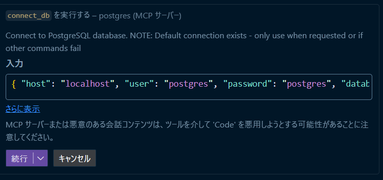

# MCP PostgreSQL Server を使用したテストデータ作成ハンズオン

## 学習目標

このハンズオンでは、MCP（Model Context Protocol）PostgreSQL Serverを使用してデータベースにテストデータを効率的に作成する方法を学習します。
複雑なリレーションを持つEC通販システムのデータベースに対して、MCPツールを使用してテストデータを挿入し、実際の開発現場で使えるスキルを身につけることが目標です。

## 時間配分（総時間：25分）

- **チュートリアル: ER図作成**: 15分
  - データベース接続・構造確認
  - Mermaid ER図作成
- **課題: 大量データ作成**: 10分
  - 大量データ作成

## MCPを使用する理由

従来の方法で複雑なリレーションを持つデータベースに1000件のテストデータを作成する場合：

1. **シーダー作成**: 各テーブルのシーダーを個別に作成
2. **依存関係管理**: テーブル間の依存関係を正しく設定
3. **データ整合性**: 外部キー制約やビジネスルールを満たすデータ作成 ([想定システム](#想定システム))
4. **バリエーション**: 現実的なデータパターンの作成

これらの作業は非常に時間がかかり、エラーも発生しやすいです。
MCPを使用することで、自然言語でデータの要求を伝え、AIが自動的に適切な形式でデータを生成・投入できます。

## MCP PostgreSQL Server の導入（5分）
[MCP PostgreSQL Server](https://github.com/antonorlov/mcp-postgres-server)

### GitHub Copilotでの設定

GitHub Copilotの設定ファイルに以下を追加してください：

**設定方法**

1.  CTRL + Shift + P (Windows) を押して、コマンドパレットを開きます。
2. `MCP: Open User Settings` を選択します。
3. 以下の設定を追加します：
```json
{
	"servers": {
		"postgres": {
			"type": "stdio",
			"command": "npx",
      "args": ["-y", "mcp-postgres-server"],
			"env": {
				"PG_HOST": "localhost",
				"PG_PORT": "6543",
				"PG_USER": "postgres",
				"PG_PASSWORD": "password",
				"PG_DATABASE": "postgres"
			}
		}
	},
	"inputs": []
}
```
4. VSCodeを再起動して設定を反映します。（ウィンドウの再読み込みではなく、ウィンドウを完全に閉じてください）

**注意**: データベース接続情報は実際の環境に合わせて変更してください。今回の課題では上記設定値で問題ありません。

**利用可能なMCPツール:**

- `#connect_db`: データベースへの接続
- `#list_schemas`: スキーマ一覧の取得
- `#list_tables`: テーブル一覧の取得
- `#describe_table`: テーブル構造の詳細確認
- `#query`: SQLクエリの実行
- `#execute`: データの挿入・更新・削除

### 3. データベース接続確認

```bash
# PostgreSQL が起動していることを確認
docker compose ps

# Prisma Studio起動（データベースGUI）
pnpm db:studio
```

## チュートリアル: データベース構造の理解

### ER図の作成（15分）

MCPでテストデータを作成する前に、データベースの構造とテーブル間のリレーションを理解することが重要です。
MCPツールの用途を理解し、正しいデータを作成するための基礎を学んで行きましょう。

**課題内容**

**Prismaスキーマの確認**

`packages/database/prisma/schema.prisma` ファイルを開き、テーブル構造を確認してください

**MCPツールを使用したER図作成手順**

Copilot Chatをエージェントモードに切り替え、プロンプトを入力して、ツールの使用用途を理解しましょう。

1. **データベース接続の確認** (`connect_db`)
   - **用途**: PostgreSQLデータベースへの接続
   - **プロンプト**:

   ```
   #connect_db
   データベースに接続してください
   ```

**MCPの設定が正しければツール名がハイライトされます：**
.png>)

**接続が成功すると、以下のようなメッセージが表示されますので続行を押してください：**


1. **スキーマ一覧の取得** (`list_schemas`)
   - **用途**: データベース構造の把握
   - **プロンプト**:

   ```
   #list_schemas
   スキーマ一覧を取得してください
   ```

2. **テーブル一覧の取得** (`list_tables`)
   - **用途**: テーブル構造の把握
   - **プロンプト**:

   ```
   #list_tables
   テーブル一覧を取得してください
   ```

3. **テーブル構造の詳細取得** (`describe_table`)
   - **用途**: テーブルの列情報、型、制約の確認
   - **プロンプト**:

   ```
   #describe_table
   各テーブルの構造を詳しく取得してください
   ```

  `describe_table` は続行ボタンの横にある下矢印をクリックして、常に許可を選択してください

5. **リレーション情報の取得** (`query`)
   - **用途**: データの検索・確認（外部キー制約の取得）
   - **プロンプト**:

   ```
   #query
   外部キー制約と参照関係を全て取得してください
   ```

**その他の利用可能なMCPツール**

6. **execute**
   - **用途**: データの作成・更新・削除（INSERT, UPDATE, DELETE）
   - **注記**: このツールは後のハンズオン実習でテストデータを挿入する際に使用します

### 課題の成果物

MCPツールの理解が出来たはずなので以下を作成してください：

1. **プロンプト**
  ```
  - 完全なMermaidのER図出力
   - 全17テーブルの詳細な構造定義
   - 各テーブル間のリレーション
   - フィールドの型とキー情報（PK、FK、UK）
  ```
2. **[Mermaid Live Editor](https://mermaid.live/edit)に出力されたMermaidコードを記載**

## ハンズオン実習

#### データ挿入前後での画面確認手順

データ作成前後で実際の画面を確認し、テストデータが正しく反映されているかを確認しましょう。

**1. データ挿入前の確認**

```bash
# 開発サーバーを起動
pnpm dev

# Prisma Studioでデータベースの状態を確認
pnpm db:studio
```

以下のURLにアクセスして現在の状態を確認してください：

- フロントエンド: http://localhost:3001
- Prisma Studio: http://localhost:5555

**確認項目:**

- [ ] 各テーブルのレコード数
- [ ] 注文一覧画面が表示されるか
- [ ] 商品一覧画面が表示されるか

### データ作成のコツ

以下のポイントに注意して、MCPツールを使用してテストデータを作成してください：

1. **段階的な作成**: 依存関係の順序を守る
2. **現実的なデータ**: 実際の使用シーンを想定
3. **バリエーション**: 偏りのないデータ分布
4. **関連性の確保**: 外部キーの整合性
5. **オートインクリメントの考慮**: 主キーはDEFAULTを使用し、明示的に値を指定しない
6. **既存データの確認**: データ挿入前に既存レコードを確認し、重複を避ける

### 課題2: 大量データの作成（10分）

**課題内容**

MCPツールを使用して、以下の大量データを作成：

- 注文 1000件
- 注文明細 3000件
- 決済情報 1000件
- 配送情報 1000件

## 完了後の確認項目

- [ ] 全てのテーブルにテストデータが作成されている
- [ ] 外部キー制約が正しく設定されている
- [ ] 1000件以上の注文データが作成されている
- [ ] データの整合性が保たれている
- [ ] 現実的なデータパターンが作成されている

## 注意事項とベストプラクティス

### 重要な注意点

1. **データベースの変更リスク**
   - MCPツールは直接データベースを操作します
   - 誤った操作でテーブル構造が変更される可能性があります
   - 必要に応じて作業前にデータベースのバックアップを取得してください

2. **開発環境での使用**
   - 本番環境では絶対に使用しないでください
   - ローカル環境でのテスト・開発用途に限定してください

3. **データの整合性**
   - 外部キー制約を意識してデータを作成してください
   - ビジネスルールに従ったデータを作成してください
   - オートインクリメントフィールドは明示的に値を指定せず、データベースに自動生成させてください
   - 既存データの有無を事前に確認し、重複データの作成を避けてください

### ベストプラクティス

1. **段階的な作成**

   ```
   1. マスタデータ（カテゴリ、サプライヤー、決済方法など）
   2. 商品データ
   3. 顧客データ
   4. 注文データ
   ```

2. **データの検証**

   ```bash
   # データ作成後は必ず確認
   pnpm db:studio
   ```

3. **エラー時の対応**

   ```bash
   # エラーが発生した場合はリセット
   pnpm db:reset
   pnpm db:seed
   ```

## 想定システム

このプロジェクトは以下のような複雑なリレーションを持つEC通販システムです：

- **注文管理**: 注文 → 注文明細 → 商品 → カテゴリ/サプライヤー
- **決済管理**: 注文 → 決済情報 → 決済方法
- **配送管理**: 注文 → 配送情報 → 配送先住所 → 配送方法
- **在庫管理**: 発注 → 入荷 → 商品 → サプライヤー

## なぜこのような複雑なリレーションが必要なのか

EC通販システムでは、以下のビジネス要件を満たすために複雑なリレーションが必要です：

### 1. マルチサイト・マルチショップ対応

```
Site → Shop → Order
```

- **理由**: 1つの企業が複数のECサイト（本店、アウトレット、期間限定ショップ）を運営
- **メリット**: サイト別の売上分析、在庫管理、顧客管理が可能
- **実例**: 楽天市場内の複数店舗、Amazon内の複数ブランド

### 2. 注文の複雑性への対応

```
Order → OrderItem → Product → Category/Supplier
```

- **理由**: 1つの注文に複数商品、商品には分類と仕入先が必要
- **メリット**:
  - 注文明細ごとの管理（個別キャンセル、部分発送対応）
  - カテゴリ別売上分析
  - サプライヤー別発注管理
- **実例**: Amazonの複数商品注文、商品別配送状況

### 3. 決済の多様性と追跡

```
Order → PaymentInfo → PaymentMethod
```

- **理由**: 現代のEC決済は多様（クレジット、コンビニ決済、後払い等）
- **メリット**:
  - 決済方法別の分析
  - 決済状況の詳細追跡
  - 返金・キャンセル対応
- **実例**: 複数決済手段の提供、決済状況の詳細管理

### 4. 配送の複雑性

```
Order → Shipment → ShippingAddress
Order → DeliveryMethod → DeliverySlot
```

- **理由**: 配送方法、配送先、配送時間帯の柔軟な管理が必要
- **メリット**:
  - 配送方法別の料金計算
  - 時間帯指定への対応
  - 配送状況の詳細追跡
- **実例**: ヤマト運輸の時間帯指定、当日配送オプション

### 5. 在庫・仕入管理の自動化

```
Order → PurchaseOrder → Receiving
Supplier → Product → OrderItem
```

- **理由**: 注文に応じた自動発注と入荷管理
- **メリット**:
  - 在庫不足の防止
  - 仕入先との連携
  - 入荷予定の可視化
- **実例**: Amazonの自動発注システム、在庫管理システム

### 6. 履歴管理とトレーサビリティ

```
Order → OrderStatusLog
```

- **理由**: 注文状況の変化を全て記録
- **メリット**:
  - 問題発生時の原因追跡
  - 顧客への状況説明
  - 業務改善のための分析
- **実例**: 注文から配送完了までの詳細ログ

### 8. 実際のビジネスシナリオ例

**注文処理フロー**:

1. 顧客が複数商品を注文 → `Order` + `OrderItem`
2. 決済処理 → `PaymentInfo`
3. 在庫確認・発注 → `PurchaseOrder`
4. 商品入荷 → `Receiving`
5. 配送準備 → `Shipment`
6. 配送完了 → `OrderStatusLog`

**分析・レポート**:

- サイト別売上: `Site` → `Order`
- カテゴリ別売上: `Category` → `Product` → `OrderItem`
- サプライヤー別発注: `Supplier` → `PurchaseOrder`
- 配送パフォーマンス: `DeliveryMethod` → `Shipment`
